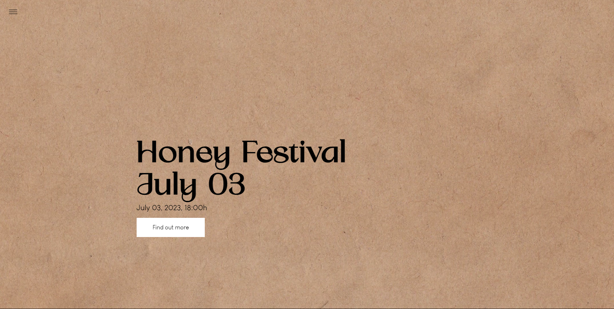

# Honey Festival

A static site built with HTML and CSS to showcase the events, activities, and information about the Honey Festival.

## Visit the Website

[Honey Festival Website](https://honeyfestival.onrender.com/)

## Table of Contents

- About us
- Location
- Testimonials
- Form and shopping for tickets
- Contact

## Features

- Interactive components showing information about the festival
- A simple form for visitors to get in touch with the organizers and buy tickets.
- The website is fully responsive and optimized for all devices.

## Built With

- **HTML**: For the structure of the web pages.
- **CSS**: For styling and layout.
- **Google Fonts**: For custom typography.
- **Responsive Web Design Techniques**: For making the site mobile-friendly.

## Contact

For questions and feedback please reach out to:

- Marina Žižić
- Email: marinazizicc@gmail.com
- GitHub: [marinazizic](https://github.com/marinazizic)
